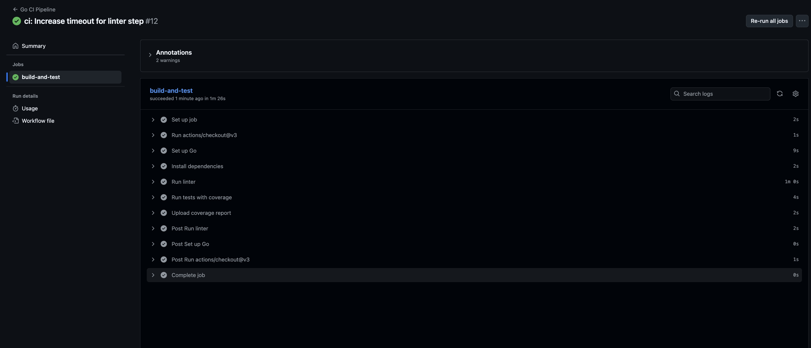

# Savannah Informatics - Backend Technical Challenge

This project is a complete, production-ready Go service built to fulfill the Savannah Informatics backend technical challenge. It features a REST API for managing customers and orders, secured with OIDC, and integrated with an external SMS service for notifications. The entire project is containerized, tested, and includes a full CI pipeline.

[](https://golang.org/)
[](https://github.com/your-username/savannah-challenge/actions)
[](https://codecov.io/gh/your-username/savannah-challenge)

## Features

-   **RESTful API:** Clean, simple endpoints for creating customers and orders.
-   **Secure by Design:** Order creation is protected using OpenID Connect (OIDC) with JWT Bearer token authentication.
-   **Asynchronous Notifications:** Utilizes a goroutine to send SMS alerts via Africa's Talking without blocking API responses.
-   **Comprehensive Testing:** Includes unit and integration tests with a high level of code coverage.
-   **Containerized:** A multi-stage `Dockerfile` creates a minimal, secure production image.
-   **Automated CI/CD:** A GitHub Actions workflow automatically lints, tests, and checks coverage on every push.

## Tech Stack

-   **Language:** Go
-   **Web Framework:** Gin
-   **Database:** SQLite (with GORM as ORM)
-   **Authentication:** OpenID Connect (OIDC) via `coreos/go-oidc` (using Google as the provider)
-   **External Services:** Africa's Talking for SMS notifications
-   **Containerization:** Docker
-   **CI/CD:** GitHub Actions

---

## Demonstration

Here are five screenshots demonstrating the key functionalities of the application.

#### 1. Successful Customer Creation (Unprotected Endpoint)
This shows a successful `POST` request to `/api/v1/customers` using `curl` and the `201 Created` response from the server.


#### 2. Successful Order Creation (Protected Endpoint)
This demonstrates a successful `POST` request to the protected `/api/v1/orders` endpoint, including the `Authorization: Bearer <TOKEN>` header.


#### 3. Server Logs Confirming SMS Notification
The application logs clearly show the successful asynchronous call to the Africa's Talking service after an order is created.


#### 4. Successful Automated Test Run
This screenshot shows the output of `go test -v -cover ./...`, confirming that all unit and integration tests pass successfully and reporting code coverage.


#### 5. Successful CI Pipeline on GitHub Actions
The GitHub Actions tab shows the "Go CI Pipeline" workflow passing with a green checkmark, proving the effectiveness of the automated quality gates.



---

## Getting Started

### Prerequisites

-   Go (version 1.19+)
-   Docker (optional, for containerized deployment)
-   A Google Cloud Project with an OAuth 2.0 Client ID
-   An Africa's Talking Sandbox Account

### 1. Clone the repository

```sh
git clone https://github.com/your-username/savannah-challenge.git
cd savannah-challenge